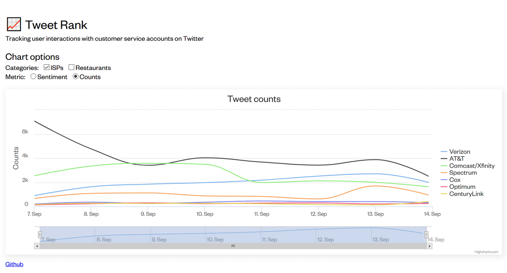

# Tweetrank
Visualizing sentiments directed towards customer service accounts on Twitter

Demo: [tweetrank.drew.hu](https://tweetrank.drew.hu)

## Requirements
**Python Requirements**
* Flask
* Gunicorn
* [VADER](https://github.com/cjhutto/vaderSentiment) (Sentiment analysis)

## How is sentiment computed?
For this project, we decided on using VADER, because it is:
 1. **Effective**. VADER is designed for social media text, so we can use it out of the box.
 2. **Fast**. VADER is a rule-based tool, so we can process many Tweets with few resources.
 3. **Free**. SaaS services like Google Natural Language can get pricey considering the volume of Tweets to process. 
 Running the sentiment analysis locally helps reduce cost.

